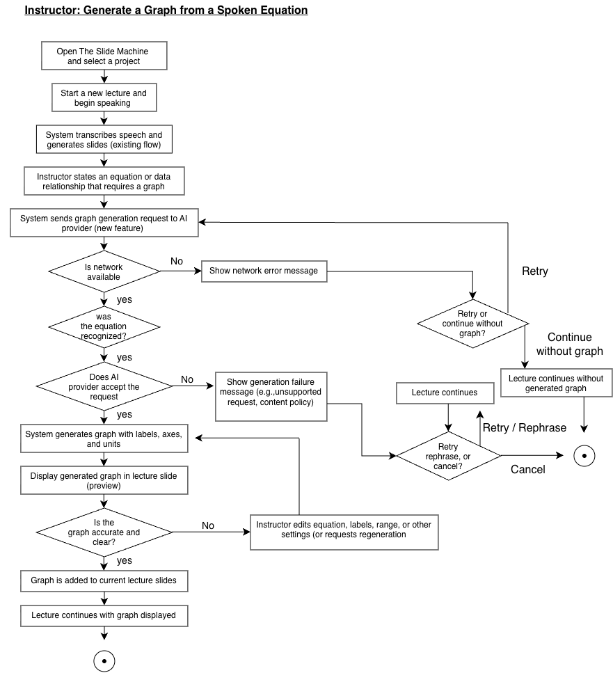
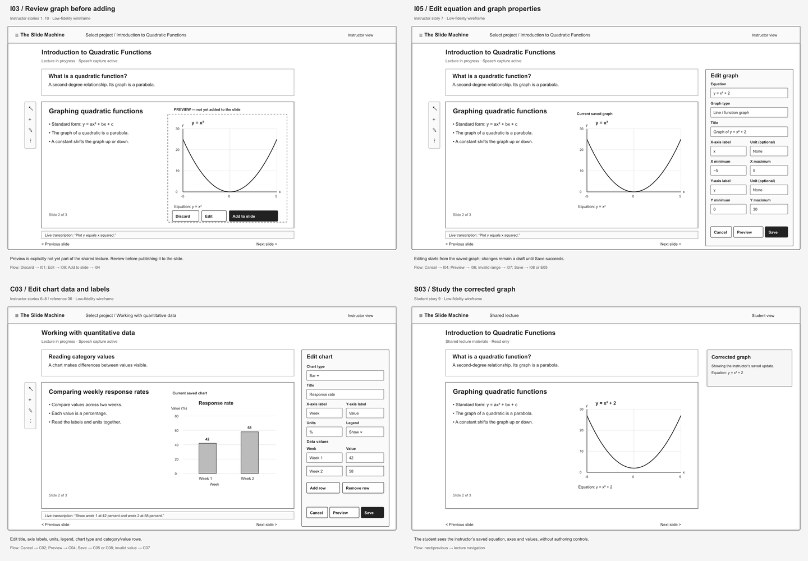

# Specification Phase Exercise

A little exercise to get started with the specification phase of the software development lifecycle. In this exercise, your team specifies a set of improvements and new features for [The Slide Machine](https://theslidemachine.com) — see the [instructions](instructions.md) for detail, and the [background](background.md) for an introduction to the software product you are tasked with extending.

## Team members

Jialiang Cao https://github.com/jialiangcao \
Rayyan Ahmed https://github.com/RayyanAhmed21 \
Abel Ma https://github.com/Abel200595 \
Rwan Z https://github.com/rz3007

## Review of the Current Application

The following list is based on testing and observations of using The Slide Machine with physics lectures, introduction to Python lectures and mathematics lessons:

1. **[Strength]** The program accurately produced simple math equations when verbalized during lectures.

2. **[Strength]** If the program accurately identified the direction of the lecture, then it could produce relevant slides in real-time.

3. **[Strength]** Mistaken and unnecessary generated items could be easily edited or deleted. Additionally, the lecturer was able to delete unnecessary slides during the lecture.

4. **[Weakness]** The generated images or animations did not always correspond to the concept being discussed.

5. **[Weakness]** The program did not always understand the correct context of what was said. Incidental remarks, transitions and future concepts would sometimes cause irrelevant slides to be generated.

6. **[Weakness]** The program found it easier to predict the correct information when the lecture was structured according to the pre-prepared outline, while natural digressions from the outline caused generation of irrelevant slides.

7. **[Weakness]** The program sometimes would regenerate the same slide multiple times during the lecture, making the lecture difficult to follow.

8. **[Weakness]** The summary and key takeaways slides were not always relevant. In some cases, the slides would contain new or future topics instead of summarizing the previous material.

9. **[Weakness]** The programming information in the lectures was not always recognized properly. Print("Hello World"), for example, would not be rendered as code and programming keywords were not distinguishable from regular text. Additionally, some unintended code, like x = 10 would be generated.

10. **[Weakness]** The fast speech rate and differences in pronunciation or accents sometimes caused the system to fall behind the lecture or misunderstanding parts of it.

11. **[Weakness]** Some generated exit ticket questions were incorrect or did not correspond to the lecture material.

12. **[Gap]** The program did not have the capability of generating the actual graph if the lecturer asked for one. Instead, it would show generic images of parabola-like graphs.

13. **[Gap]** The text boxes were not able to be repositioned, so a lecturer is not able to control the distance between the text boxes and borders of the slides.

14. **[Gap]** The program did not seem to react when the lecturer directly addressed it ("Slide Machine") and made a request verbally during the lecture.

## Prior Art & Originality

We examined existing Software Design Document (SDD) for The Slide Machine, namely Sections 18 (Future Work) and 19 (Open Questions), as well as its delivery roadmap and publicly available GitHub issues and pull requests.

Existing application already provides live generation of slides from speech, generation of mathematical content and slides in general, as well as editing of generated slides, optionally with AI-generated images. So, these features are not presented as original contribution.

The closest field that could be seen from the existing documentation is an open question about the accuracy of generated diagrams and infographics. However, it does not state structured generation of mathematical graphs and charts based on spoken equations and numbers specifically.

Our contribution is the addition of structured graph and chart generation capability directly into the live lecture process of The Slide Machine.

The proposed set of features includes:

1. Generation of mathematically correct graphs and charts from instructors' spoken requests instead of approximate or generic images.

2. Providing axes labels, numerical scales, units, equations, and appropriate ranges of graphs.

3. Allowing instructors to select, edit generated graphs and charts, including their equations, data values, ranges, labels, and types of chart.

4. Modification of corrected visuals right in the lecture slides and saving of final results in shared lecture material for students.

5. Appropriate error handling when the request cannot be fulfilled or the graph cannot be generated, allowing instructors to correct or cancel their request.

Our review of existing SDD of The Slide Machine with the list of future work, open questions and delivery roadmap did not indicate any feature set similar to the proposed one among those that are explicitly mentioned.

So, the originality claim is the proposed graph and chart generation workflow as part of the existing lecture experience rather than the concept of mathematical plotting or automated slide generation in general.

## Stakeholders

We conducted four interviews with two instructors and two students who were affected by our proposed changes as users. Partial names/pseudonyms are used in this public repository to protect privacy of participants. Full names and contacts will be provided privately to the course administrators if required.

### Instructor Stakeholders

- Instructor A – A-Level physics teacher with experience of teaching concepts that are usually presented via graphs, such as motion, forces, relationship between physical quantities.
- Instructor B – A-Level mathematics teacher with experience of teaching functions, coordinate graphs, transformations and other visual concepts.

In our conversation with each instructor we asked them about their existing teaching practice and made them try The Slide Machine application. Special attention was paid to the way the application handles mathematical and scientific content that would require graph or chart visualization usually.

#### Instructor Goals / Needs

1. Visualization of concepts. Instructor needs graphs and charts to provide the same mathematical or scientific relationship that he/she explains verbally.

2. Axes, labels, scales and units. A graph should contain enough context for students to understand the meaning of each axis and of values that are plotted there.

3. Fast generation during live lecture. Graphs should be generated fast enough to allow instructors to continue lecture.

4. Possibility to correct generated graphs. Instructor needs the possibility to correct equation, data value, range, label or any other parameter of the generated graph.

5. Support of various types of academic visuals. Instructors need graphs of functions, data values, line charts, bar charts and other typical visual representations depending on subject matter.

6. Consistency of visual representation and verbal explanation. Students should see the visual representation of the concept that instructor explained verbally rather than some approximate or irrelevant image.

#### Instructor Problems / Frustrations

1. Incorrect graphs can confuse students. An inaccurate visual representation of an equation or some data can mislead students more than no graph at all.

2. Generic images are not a good alternative for real graphs. When some specific mathematical graph is required, it cannot be replaced with some approximate image.

3. Generation or search of graphs during live lecture can interrupt teaching process. Switching to some other application or generating graphs manually can interrupt a live class.

4. Lack of the possibility to correct generated graphs reduces instructor's confidence. If the graph generated by application is slightly incorrect, instructor needs to be able to correct it without discarding it completely.

5. Missing labels or inappropriate scales can reduce clarity of the correct graphs.

6. Generated content needs to be consistent with notation and terminology used by instructors in different subjects.

### Student Stakeholders

- Student A – Student with experience of studying mathematics and science topics containing equations, functions and visual representations.
- Student B – A student who often uses lecture slides and visual material while reviewing quantitative subjects.

Each student was asked about his/her experience in studying from lecture slides, especially how students deal with equations, numbers and graphs. Besides, each student tried the The Slide Machine application to understand how automatically generated visuals can influence his/her learning experience.

#### Student Goals / Needs

1. Visualization of equations. Students need to see how some mathematical expression or scientific relationship behaves rather than only the equation itself.

2. Graphs corresponding to the instructor's explanation. Students need visual representation to be consistent with the concept explained in class.

3. Clear labels of visuals. Labels of axes, units, values, title and other elements of the visual help students to interpret graph correctly.

4. Visuals for revision. Students highly appreciate the opportunity to have the same graphs and charts used during the lecture in shared lecture materials to use them while revising the lesson.

5. Accuracy of graphs and data. Students need to be sure that graphs they use for revision are mathematically or scientifically correct.

6. Simple and clear visuals. Graphs should convey the important relationship clearly and with minimal visual noise.

#### Student Problems / Frustrations

1. Equations can be hard to interpret. Written mathematical expression can show the relationship but cannot demonstrate how it works.

2. Incorrect graphs can mislead students. Students will probably use incorrect material found on lecture slide while revising it.

3. Generic images are useless when a specific graph is required. For example, an image of parabola does not guarantee that it shows the required function, scale, coordinates and transformations.

4. Unlabeled or incorrectly scaled graphs are difficult to interpret.

5. Lack of important visual in the lecture slide can be a problem for students to reconstruct the instructor's explanation later.

6. Inconsistent visual representations can make it difficult to connect spoken explanation, equation and lecture note.

### Stakeholder Observation Summary

Among both user types accurate visual representation of mathematical or scientific concepts was identified as important need for quantitative lecture material. Instructors highly valued the possibility to generate and correct graphs without interrupting lecture, while students emphasized the usefulness of visuals for better understanding and revision.

Using The Slide Machine application we paid attention to requests for mathematical or scientific graphs. All these observations, together with the stakeholder interviews, inspired us to conduct further research on structured graph and chart support as an extension of the application.

## Product Vision Statement

Extend The Slide Machine with the structured, editable graph and chart generation that allows instructors to convert spoken equations, data and quantitative relationships to accurate and clearly labeled visuals during live lectures, providing students with clear visual representations that remain in the shared lecture material for understanding and revision.

## User Requirements
### Instructor User Stories
1. As an instructor, I want The Slide Machine to generate a graph from an equation I say during lecture so that I can visually explain the relationship to my students.   
2. As an instructor, I want to generate charts from numerical data I describe aloud so that I can represent quantitative information without switching to another application.
3. As an instructor, I want generated graphs to include clearly labeled axes so that students know what each axis represents.
4. As an instructor, I want to specify units for graph axes so that the visual accurately represents the scientific or mathematical quantities I am discussing.
5. As an instructor, I want to adjust the range and scale of a generated graph so that I can focus on the portion that is relevant to my explanation.
6. As an instructor, I want to edit the equation or data used to generate a graph so that I can correct errors if The Slide Machine misinterprets what I said.
7. As an instructor, I want to edit graph labels, titles, and units so that I can correct or clarify the generated visual before using it in my lecture.
8. As an instructor, I want to choose between appropriate graph and chart types so that I can use the visual representation that best fits the material I am teaching.
9. As an instructor, I want generated graphs and charts to appear quickly during a live lecture so that creating a visual does not interrupt the flow of my teaching.
10. As an instructor, I want to review and correct a generated graph before relying on it in my lecture so that students are not shown inaccurate information.
11. As an instructor, I want corrected graphs to remain in the final shared lecture deck so that students can review the accurate version after class.

### Student User Stories 
1. As a student, I want to see a graph that corresponds to an equation discussed in class so that I can understand the equation visually.
2. As a student, I want graphs to match the instructor's spoken explanation so that I can connect what I hear with what I see on the slide.
3. As a student, I want graph axes to be clearly labeled so that I can understand what each variable represents.
4. As a student, I want units to be displayed on graphs when appropriate so that I can correctly interpret scientific and mathenatical quantities.
5. As a student, I want important values and plotted data to be clearly represented so that I can undertsand the relationship being discussed.
6. As a student, I want graphs and charts to use readable scales so that I can interpret the visual wihtout having to guess what the values mean.
7. As a student, I want generated graphs to be simple and easy to read so that I can understand them while also following the live lecture.
8. As a student, I want graphs used during the lecture to remain in the shared lecture materials so that I can review them later while studying.
9. As a student, I want corrected versions of inaccurate graphs to appear in the shared lecture materials so that I do not study from incorrect information.
10. As a student, I want equations and their corresponding graphs to appear together in the lecture material so that I can understand the connection between the mathematical expression and its visual behavior.
11. As a student, I want charts generated from lecture data to accurately represent the values discussed by the instructor so that I can trust the visuals when reviewing the material later.  

      
## Activity Diagrams
### Activity Diagram 1 — Instructor: Generate a Graph from a Spoken Equation

**User Story #1:**  
As an instructor, I want The Slide Machine to generate a graph from an equation I say during lecture so that I can visually explain the relationship to my students.

### Activity Diagram 2 — Instructor: Edit a Generated Graph

**User Story #7:**  
As an instructor, I want to edit graph labels, titles, and units so that I can correct or clarify the generated visual before using it in my lecture.

### Activity Diagram 3 — Student: View a Generated Graph in Shared Lecture Materials

**User Story #8:**  
As a student, I want graphs used during the lecture to remain in the shared lecture materials so that I can review them later while studying.

### Activity Diagram 4 — Student: View a Corrected Graph in Shared Lecture Materials

**User Story #9:**  
As a student, I want corrected versions of inaccurate graphs to appear in the shared lecture materials so that I do not study from incorrect information.

## Wireframes

- [Open the editable Figma file](https://www.figma.com/design/wSWJrmAMIJM4rebIHOglQ4?node-id=2-2)

| Group | Screens | What they cover |
|---|---|---|
| Instructor graphs | I01–I10 | Requesting a graph, checking the preview, adding it, selecting it, and editing the saved version |
| Instructor charts | C01–C08 | Reviewing a chart, editing its data and labels, previewing changes, and handling invalid values or a failed save |
| Student views | S01–S09 | Viewing saved graphs and charts, opening corrections, and continuing when a visual cannot load |
| Errors and recovery | E01–E05 | Connection problems, an unrecognized equation, unsupported requests, the usage limit, and graph save failures |

For the main graph flow, follow **I01 → I02 → I03 → I04**. To edit it, continue through **I05 → I06 → I08**. The matching student correction flow is **S01 → S02 → S03**. The chart example follows **C01 → C02 → C03 → C04 → C05**, with **S08/S09** showing the original and corrected student views.

## Clickable Prototype

https://www.figma.com/proto/woA051yMbds4X3MhXzUcOl/Slide-machine-prototype?node-id=4-2&p=f&t=8Jg3sUTKa1pfnFjm-0&scaling=min-zoom&content-scaling=fixed&page-id=1%3A3&starting-point-node-id=4%3A2&show-proto-sidebar=1

## Stakeholder Demo

[Generated Slide Deck](https://theslidemachine.com/d/untitled-806df0a2)

[Recorded Demo](https://drive.google.com/file/d/1gJM_waPZtevQp83MN3MIUHWrG9B5udqR/view?usp=drive_link)

## Exit Ticket

[Exit Ticket Quiz](https://docs.google.com/forms/d/e/1FAIpQLSdbnHCg7NQ7y7C6ShiPVpyb1rhg6k9ELFrxfK0mCEWJ8VSeow/viewform)

We reviewed the generated exit ticket questions before publishing and did not need to make any corrections.
