# Wireframes — graphs and charts

These are the screens for generating, editing, and viewing graphs and charts in The Slide Machine. They cover the main flow and what happens when something goes wrong. The IDs make it easier to talk about the screens and connect them in the prototype.

[Figma file in Abel Ma's team](https://www.figma.com/design/wSWJrmAMIJM4rebIHOglQ4) · [Start here](START-HERE.md)

The frames are still static. Matt can use the paths below to connect the clickable prototype. The original Figma layout and live-app navigation still need to be checked against this draft.

## Screens and button paths

| ID | Screen or state | Related story | Where it goes |
|---|---|---|---|
| I01 | Live lecture / graph request | Instructor story 1 | recognized speech → I02 |
| I02 | Generating a graph | Instructor story 1 | success → I03; continue → I01; failures → E01–E04 |
| I03 | Review graph before adding | Instructor stories 1, 10 | Discard → I01; Edit → I09; Add to slide → I04 |
| I04 | Graph added to the lecture | Instructor stories 1, 7 | Edit graph → I05; shared view → S01 |
| I05 | Edit equation and graph properties | Instructor story 7 | Cancel → I04; Preview → I06; invalid range → I07; Save → I08 or E05 |
| I06 | Preview graph changes | Instructor story 7 | Cancel → I04; continue editing → I05; Save → I08 or E05 |
| I07 | Correct invalid graph settings | Instructor story 7 | correct X range → I05; Cancel → I04 |
| I08 | Updated graph saved | Instructor stories 7, 11 | Edit graph → I05; student opens saved correction → S03 |
| I09 | Edit a new graph request | Instructor stories 1, 6 | Generate preview → I02 then I03; Cancel → originating preview or error |
| I10 | Select a graph on the slide | Instructor story 7 / reference 02 | Edit graph → I05; Close → I04 |
| C01 | Review a chart generated from data | Instructor stories 2, 8 / reference 05 | Discard → I01; Edit → C06; Add to slide → C02 |
| C02 | Chart added to the lecture | Instructor story 2 / reference 05 | Edit chart → C03; shared lecture → S08 |
| C03 | Edit chart data and labels | Instructor stories 6–8 / reference 06 | Cancel → C02; Preview → C04; Save → C05 or C08; invalid value → C07 |
| C04 | Preview chart changes | Instructor stories 6–8 / reference 06 | Cancel → C02; continue editing → C03; Save → C05 or C08 |
| C05 | Updated chart saved | Instructor story 11 | Edit chart → C03; shared view → S09 |
| C06 | Edit a new chart draft | Instructor stories 2, 6, 8 | Cancel → C01; Generate preview → C01; invalid data → C07 (draft retained) |
| C07 | Correct invalid chart data | Instructor story 6 | correct value → C03 or C06; Cancel → originating saved chart or preview |
| C08 | Chart save failed | Instructor stories 6, 7 | Retry save → C05 if successful; Discard changes → C02 |
| S01 | View graph in shared lecture | Student story 8 | next/previous → lecture navigation; update available → S02; load failure → S04 |
| S02 | Corrected graph available | Student story 9 | View corrected graph → S03; corrected version fails to load → S04 |
| S03 | Study the corrected graph | Student story 9 | next/previous → lecture navigation |
| S04 | Shared graph cannot load | Student stories 8, 9 | Retry → S01 or S03; Continue without graph → S05 |
| S05 | Continue reviewing without graph | Student stories 8, 9 | Try loading again → S01 or S03; next/previous → lecture navigation |
| S06 | Correction not yet available | Student story 9 | continue reviewing → lecture navigation; later correction → S02 |
| S07 | Student-facing live presentation | Student stories 1–7 / reference 07 | lecture ends → shared lecture S01 |
| S08 | View a chart in shared materials | Student stories 8, 11 | next/previous → lecture navigation; load failure → S04 (chart wording) |
| S09 | Study a corrected chart | Student stories 9, 11 | next/previous → lecture navigation; load failure → S04 (chart wording) |
| E01 | Network error during generation | Instructor story 1 | Retry → I02; Continue without graph → I01 |
| E02 | Equation not recognized | Instructor story 1 | Cancel → I01; Rephrase → I01 then I02; Edit manually → I09 |
| E03 | Graph request declined or unsupported | Instructor story 1 | Continue → I01; Edit request → I09; Retry → I02 |
| E04 | Generation allowance reached | Assignment failure-path requirement | Continue without graph → I01 |
| E05 | Save failed / original retained | Instructor story 7 | Retry save → I08 if successful, otherwise E05; Discard changes → I04 |

## A few choices to keep consistent

New items go through a preview and **Add to slide**. Existing items use **Save**. This is why I09 and C06 are separate from the saved-item editors. **Cancel** keeps the original, and a preview stays private until the instructor adds or saves it.

A failed save keeps the draft for retry. A field error stays beside the field so the instructor knows what to fix. Student views stay read-only, and a missing graph should not stop students from reading the rest of the lecture.

The correction messages follow Rwan's diagram, but the team still needs to decide how a graph is marked as needing a correction. The usage-cap screen also needs to agree with the final activity diagram. The navigation is context from the shared references, so we should check it against the existing app before submission.

## Reference mapping

| Rayyan attachment | Corresponding screens |
|---|---|
| 01 — Instructor graph generated | I03, I04 |
| 02 — Instructor graph selected | I10 |
| 03 — Instructor edit graph | I05–I09 |
| 04 — Instructor graph error | E01–E04 |
| 05 — Instructor chart generated | C01, C02 |
| 06 — Instructor edit chart | C03–C08 |
| 07 — Student live view | S07 |
| 08 — Student shared deck | S01–S06, S08, S09 |

The supplied SVGs are reference work by a teammate. This package develops and extends those references; it does not claim the reference designs as Abel’s original work.

## Screen-by-screen notes

The images below can be included in the repository's Wireframes section. Keep the `png` folder next to this Markdown file so the relative image paths work. The full notes stay here even though each frame only has room for a short caption.

### I01 — Live lecture / graph request

The instructor is already in a lecture and asks for a graph while speaking. This screen gives some context for the request; the navigation around it still needs to match the existing app. For this example, the request is to plot y = x².

**Related story:** Instructor story 1.

**Button paths:** recognized speech → I02.

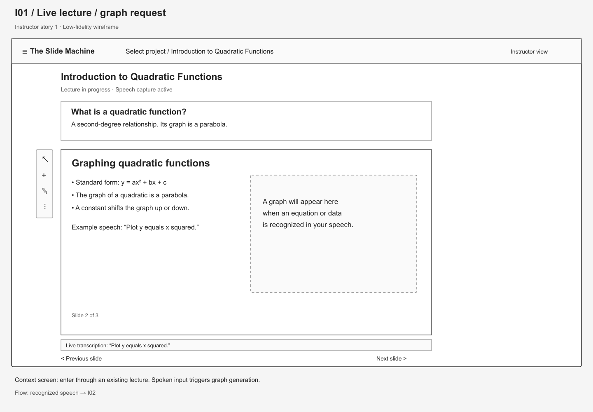

### I02 — Generating a graph

The graph is being generated, but the lecture stays on screen so the instructor can keep teaching. A successful request opens the preview. If the request fails, use the matching error state instead of leaving the loading message on screen.

**Related story:** Instructor story 1.

**Button paths:** success → I03; continue → I01; failures → E01–E04.

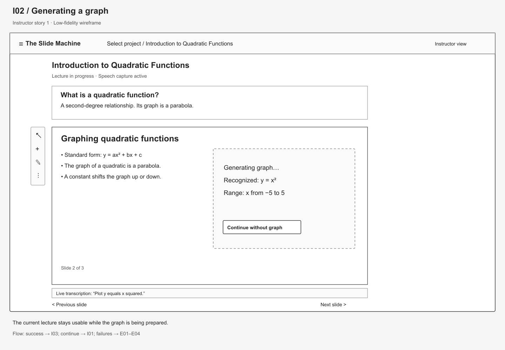

### I03 — Review graph before adding

The instructor checks the generated graph before putting it on the slide. Add to slide is the step that makes it part of the lecture. Edit opens the new-request editor, while Discard removes this preview and returns to the lecture.

**Related story:** Instructor stories 1, 10.

**Button paths:** Discard → I01; Edit → I09; Add to slide → I04.

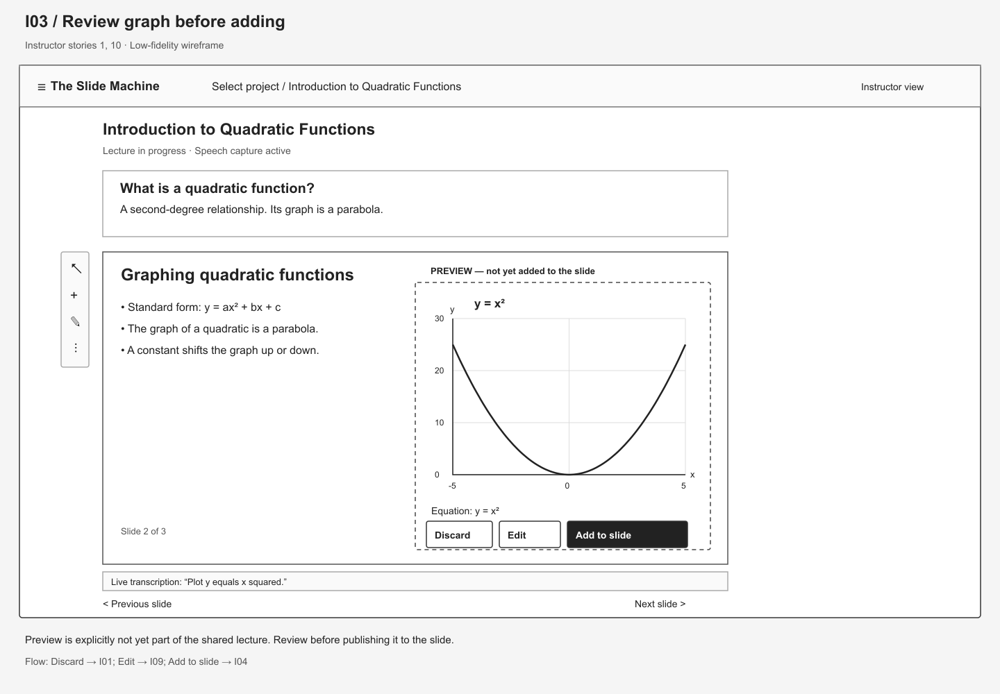

### I04 — Graph added to the lecture

The graph has been added to the slide. It can now be selected or edited, and the saved version is available in the shared lecture. This is the starting point for editing an existing graph.

**Related story:** Instructor stories 1, 7.

**Button paths:** Edit graph → I05; shared view → S01.

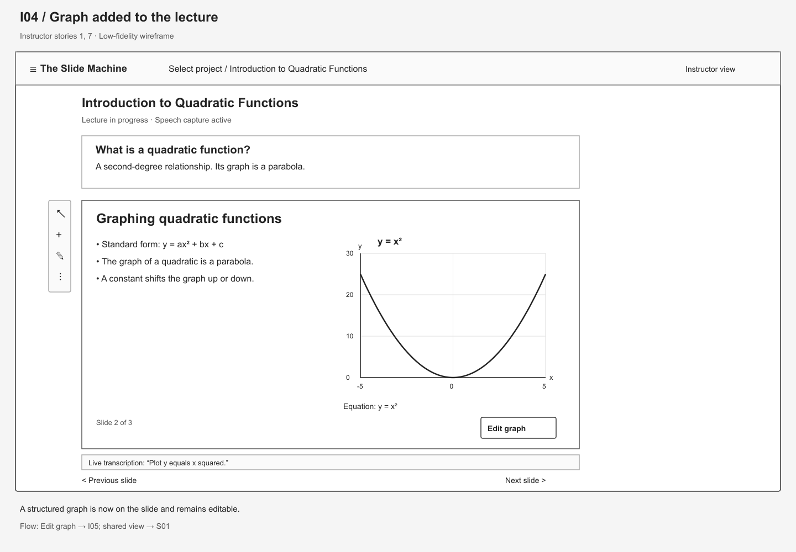

### I05 — Edit equation and graph properties

The instructor can change the equation, title, axis labels, units, and ranges in the panel on the right. The fields show the proposed change to y = x² + 2, while the slide still shows the saved graph. Preview checks the draft, Save updates it, and Cancel keeps the original.

**Related story:** Instructor story 7.

**Button paths:** Cancel → I04; Preview → I06; invalid range → I07; Save → I08 or E05.

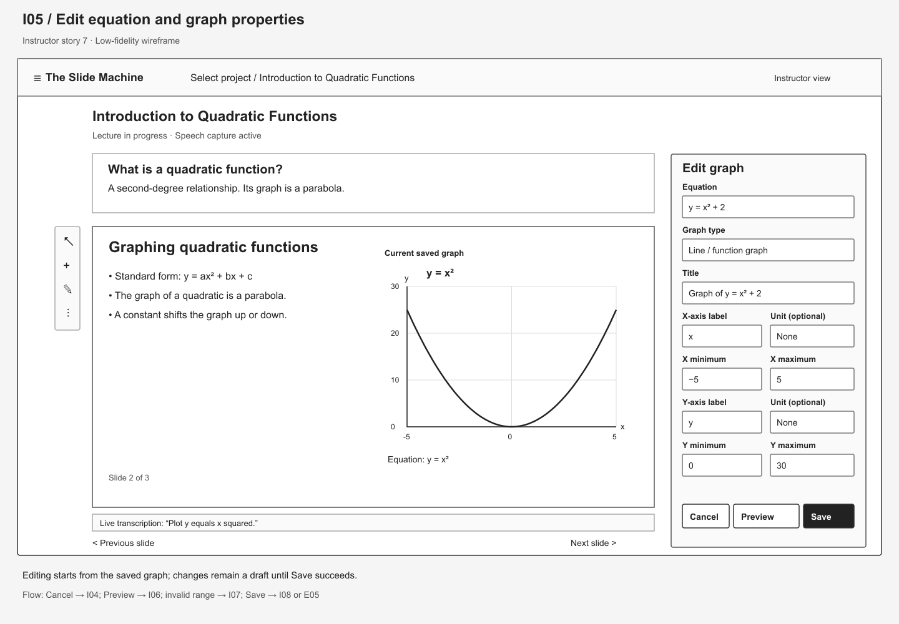

### I06 — Preview graph changes

This shows what the edited graph will look like, using y = x² + 2 as the example. The preview is still a draft, so students should not see it yet. The instructor can save it, keep editing, or cancel the change.

**Related story:** Instructor story 7.

**Button paths:** Cancel → I04; continue editing → I05; Save → I08 or E05.

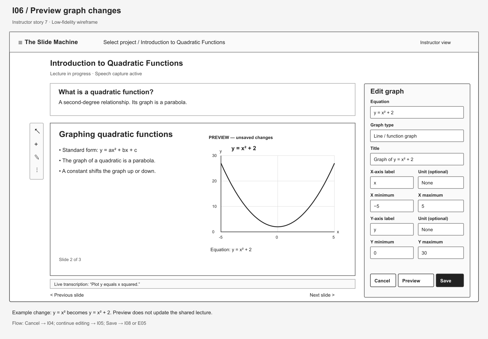

### I07 — Correct invalid graph settings

The X minimum is not smaller than the X maximum, so the range cannot be used. Keep all the entered values visible and explain the problem beside the field. Save stays unavailable until the range is fixed.

**Related story:** Instructor story 7.

**Button paths:** correct X range → I05; Cancel → I04.

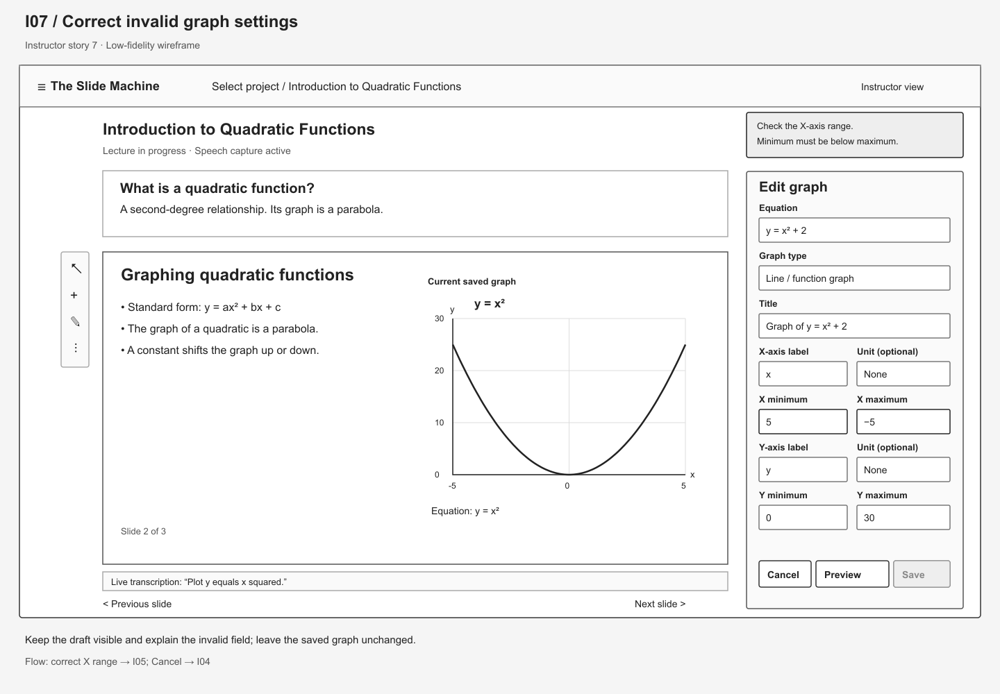

### I08 — Updated graph saved

The save has succeeded and the slide now uses y = x² + 2. The saved equation and graph should match. Students who open the corrected version should see this same content.

**Related story:** Instructor stories 7, 11.

**Button paths:** Edit graph → I05; student opens saved correction → S03.

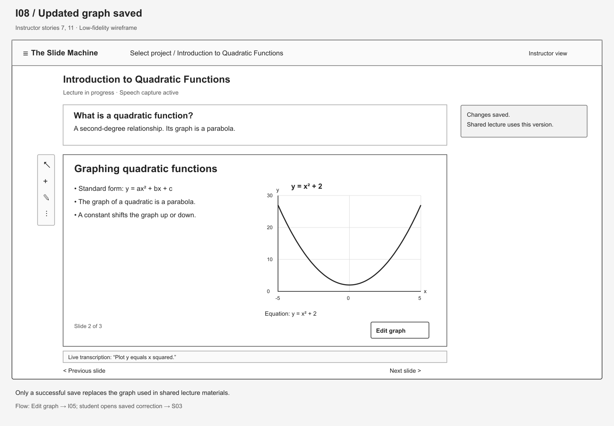

### I09 — Edit a new graph request

This editor is for a graph that has not been added yet. It can be opened from the first preview or after a request could not be understood. Generate preview sends it back through generation and review; it should not save directly over an existing graph.

**Related story:** Instructor stories 1, 6.

**Button paths:** Generate preview → I02 then I03; Cancel → originating preview or error.

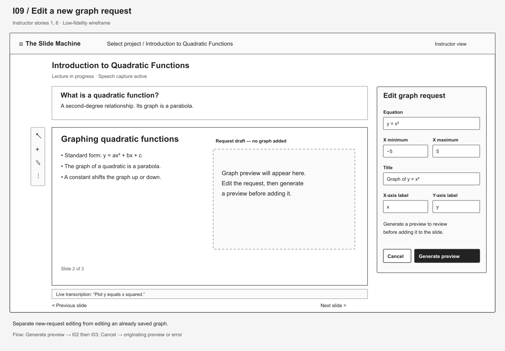

### I10 — Select a graph on the slide

Selecting a graph shows the actions for that graph. Edit graph opens the saved-graph editor, and Close clears the selection. This keeps the interaction inside the lecture canvas.

**Related story:** Instructor story 7 / reference 02.

**Button paths:** Edit graph → I05; Close → I04.

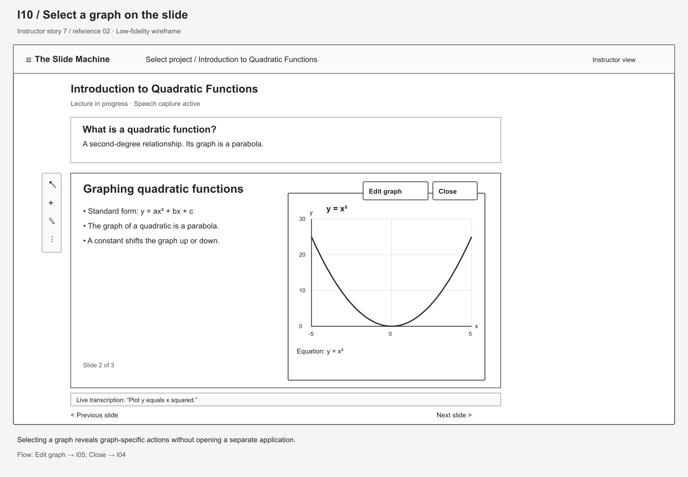

### C01 — Review a chart generated from data

The instructor reviews a chart created from spoken data before adding it. The example uses weekly percentages, with Week 1 at 42% and Week 2 at 58%. Edit opens the new chart draft, and Add to slide puts the reviewed chart in the lecture.

**Related story:** Instructor stories 2, 8 / reference 05.

**Button paths:** Discard → I01; Edit → C06; Add to slide → C02.

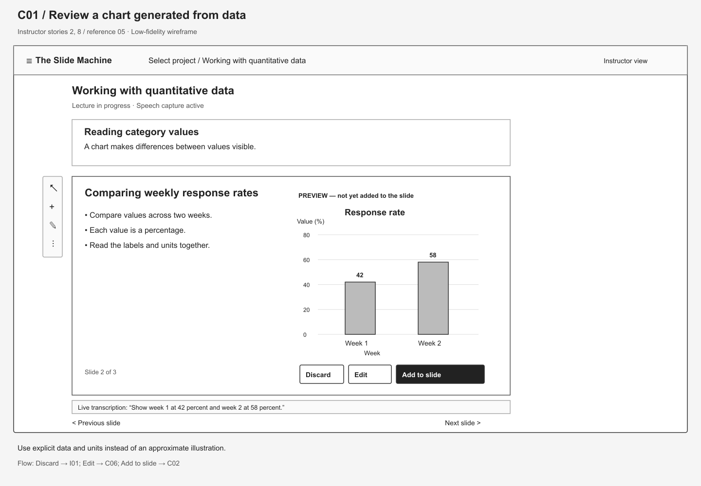

### C02 — Chart added to the lecture

The chart is now part of the lecture. The instructor can edit it, while students see the saved read-only version in S08. The chart should keep its labels and units when it moves from preview to slide.

**Related story:** Instructor story 2 / reference 05.

**Button paths:** Edit chart → C03; shared lecture → S08.

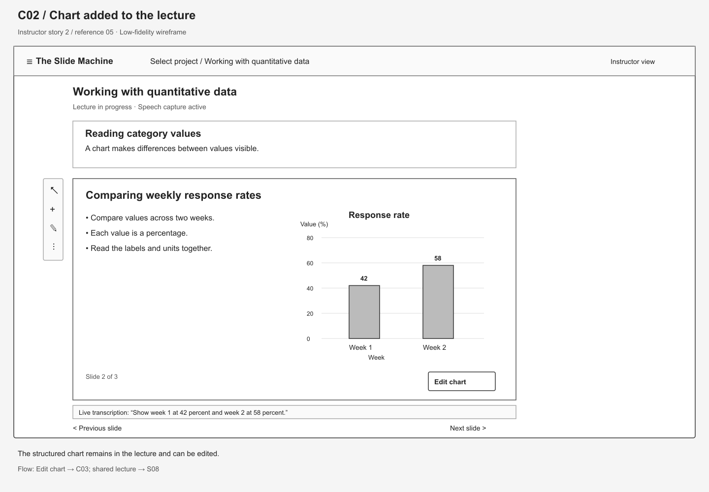

### C03 — Edit chart data and labels

The instructor edits the chart type, title, labels, units, legend, and data rows. Add row creates a blank row to fill in; Remove row removes the selected row. The example will change Week 2 from 58% to 64% in the next preview, and Preview lets the instructor check the result before saving.

**Related story:** Instructor stories 6–8 / reference 06.

**Button paths:** Cancel → C02; Preview → C04; Save → C05 or C08; invalid value → C07.

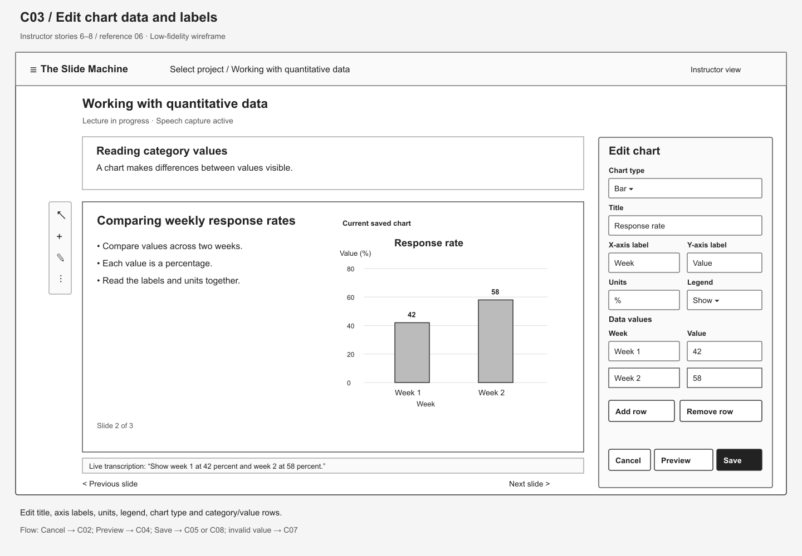

### C04 — Preview chart changes

The preview uses a line chart with Week 2 corrected to 64%. A line makes sense here because the weeks have an order. This is still an unsaved preview, so the shared lecture keeps the old values until Save succeeds.

**Related story:** Instructor stories 6–8 / reference 06.

**Button paths:** Cancel → C02; continue editing → C03; Save → C05 or C08.

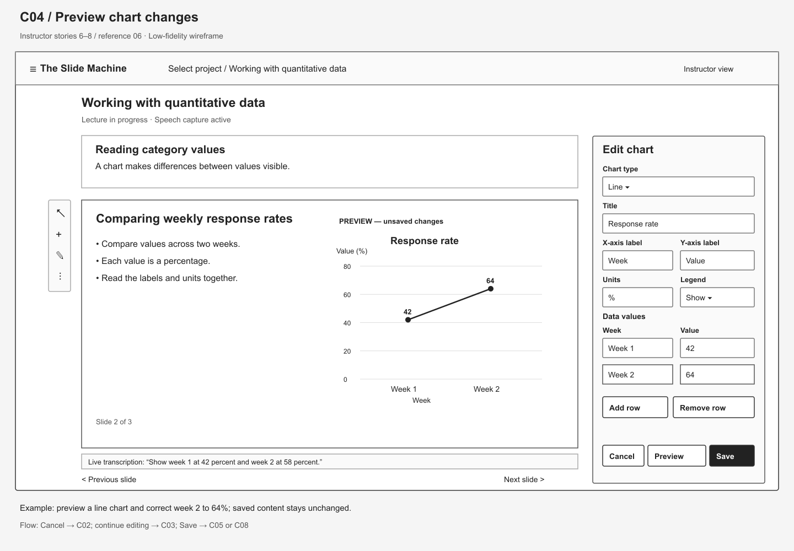

### C05 — Updated chart saved

The updated chart has been saved. Keep the selected line-chart type and the corrected 64% value in the lecture and the student view. S09 is the matching student screen.

**Related story:** Instructor story 11.

**Button paths:** Edit chart → C03; shared view → S09.

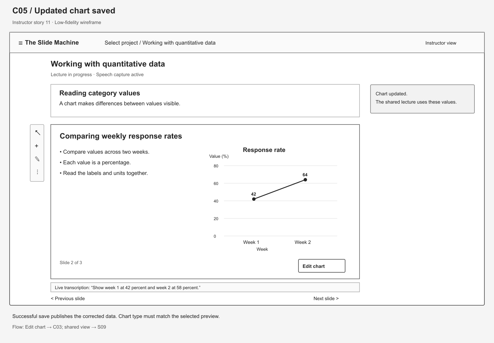

### C06 — Edit a new chart draft

This is the editing state for a new chart that has not been added to the lecture. Generate preview returns to C01 so the instructor can check it first. Cancel returns to the original preview without publishing the draft.

**Related story:** Instructor stories 2, 6, 8.

**Button paths:** Cancel → C01; Generate preview → C01; invalid data → C07 (draft retained).

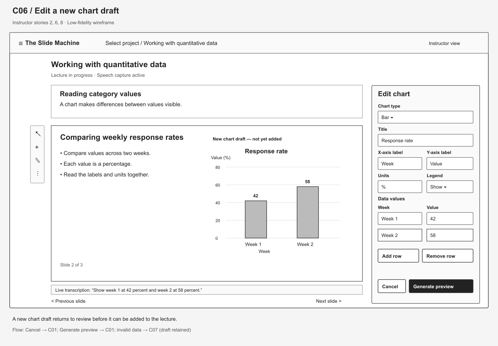

### C07 — Correct invalid chart data

A data cell contains a value that cannot be used as a number. Show the error beside that cell and keep the rest of the draft. The instructor needs to fix empty or nonnumeric values before saving or generating another preview.

**Related story:** Instructor story 6.

**Button paths:** correct value → C03 or C06; Cancel → originating saved chart or preview.

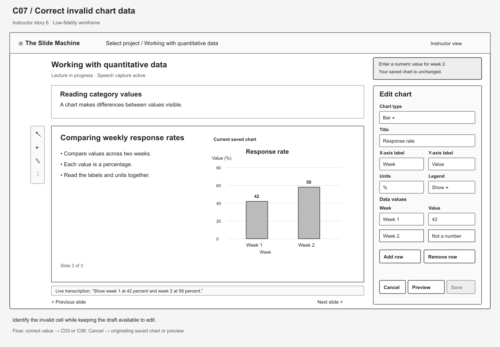

### C08 — Chart save failed

The save request failed, so the previously saved chart stays in the lecture. Retry save keeps the edited rows and settings. Discard changes returns to the original chart instead of keeping a partly saved update.

**Related story:** Instructor stories 6, 7.

**Button paths:** Retry save → C05 if successful; Discard changes → C02.

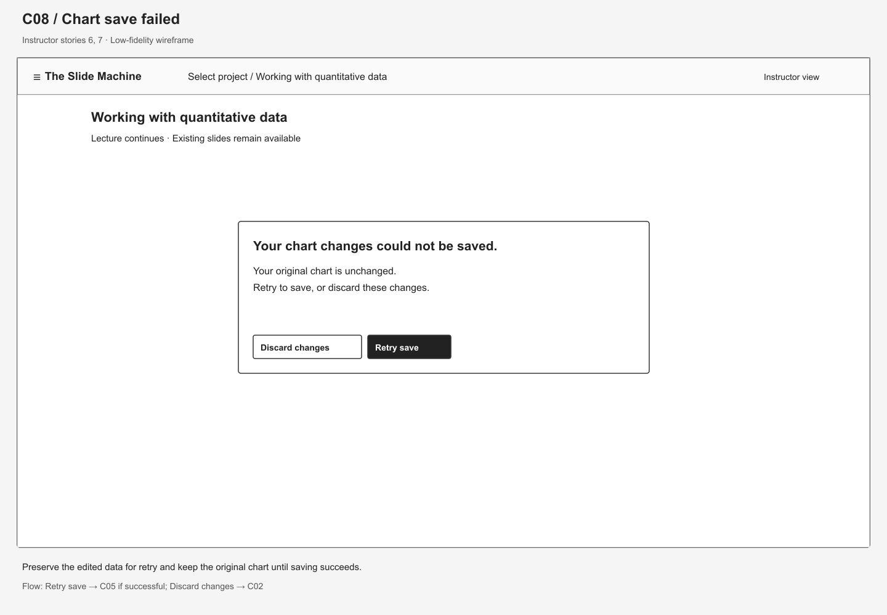

### S01 — View graph in shared lecture

The student opens the lecture through its shared link or the app's existing lecture entry. The graph is read-only and has the same equation and labels as the saved instructor version. There are no graph editing controls here.

**Related story:** Student story 8.

**Button paths:** next/previous → lecture navigation; update available → S02; load failure → S04.

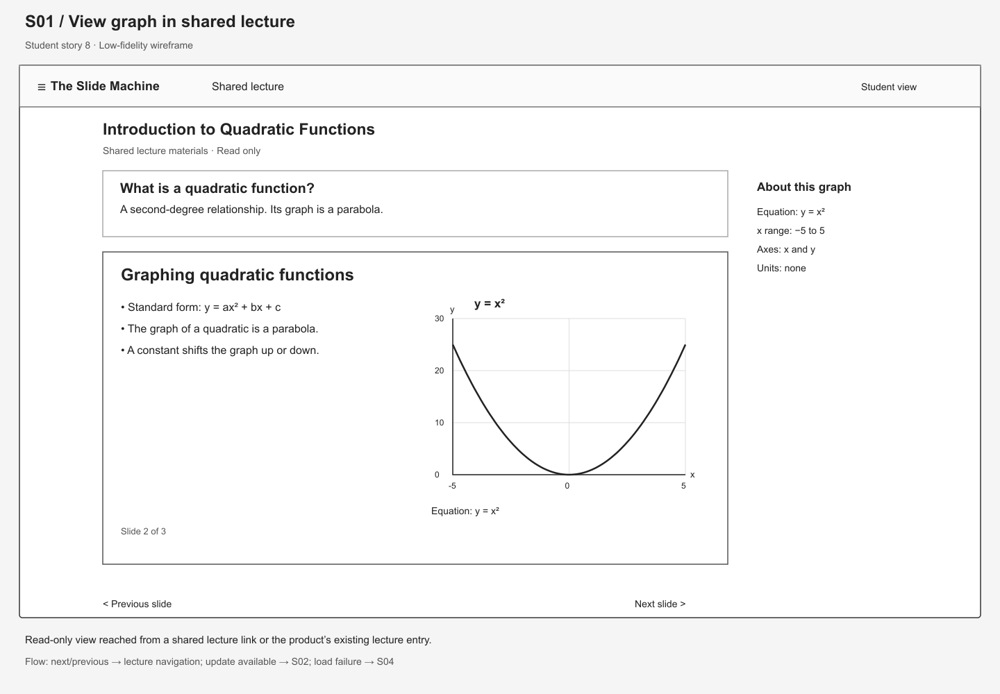

### S02 — Corrected graph available

The student is looking at the older graph and is told that a corrected version is available. View corrected graph opens S03. We still need to agree on how the app finds out an update is available and when it shows this message.

**Related story:** Student story 9.

**Button paths:** View corrected graph → S03; corrected version fails to load → S04.

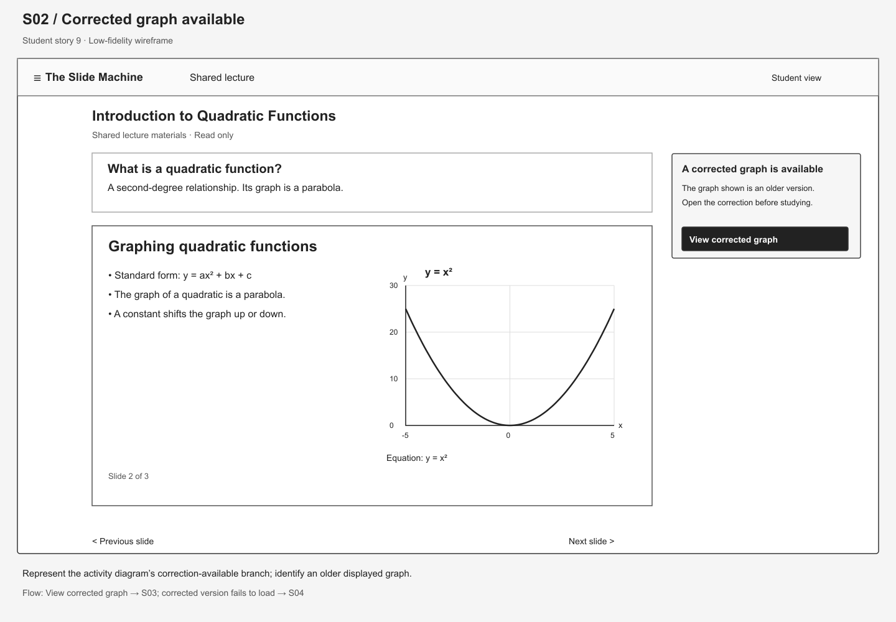

### S03 — Study the corrected graph

The student sees the instructor's saved correction, y = x² + 2. The equation, axes, and plotted curve should agree with I08. Students can continue reviewing the lecture but cannot change the graph.

**Related story:** Student story 9.

**Button paths:** next/previous → lecture navigation.

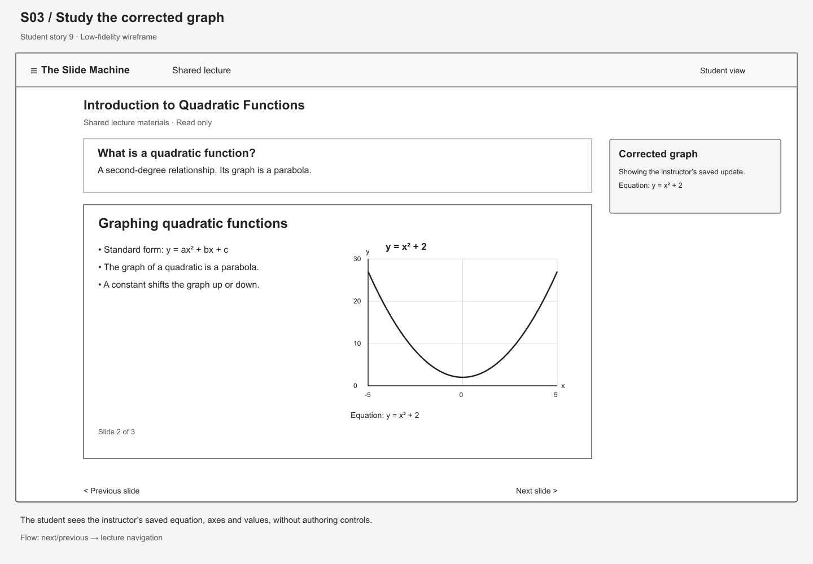

### S04 — Shared graph cannot load

The requested graph did not load. Keep the lecture text and navigation available, and offer Retry or Continue without graph. Retry should request the same version that failed, including a corrected version when that was the student's choice.

**Related story:** Student stories 8, 9.

**Button paths:** Retry → S01 or S03; Continue without graph → S05.

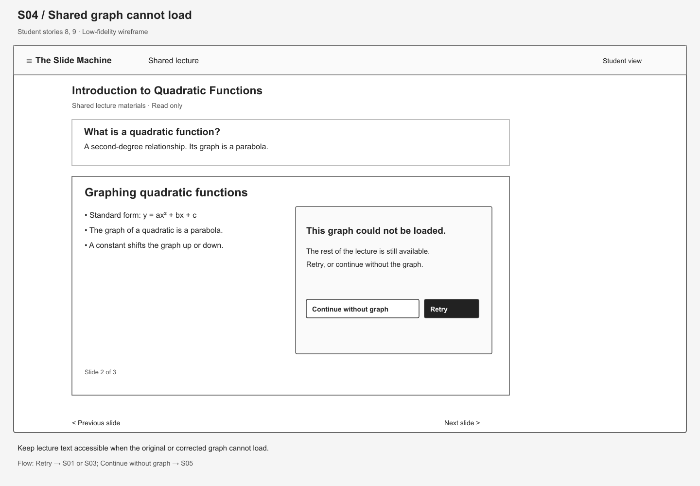

### S05 — Continue reviewing without graph

The student chose to keep reviewing without the graph. Leave a clear placeholder so they know part of the slide is missing. Try loading again gives them a way to recover without reopening the whole lecture.

**Related story:** Student stories 8, 9.

**Button paths:** Try loading again → S01 or S03; next/previous → lecture navigation.

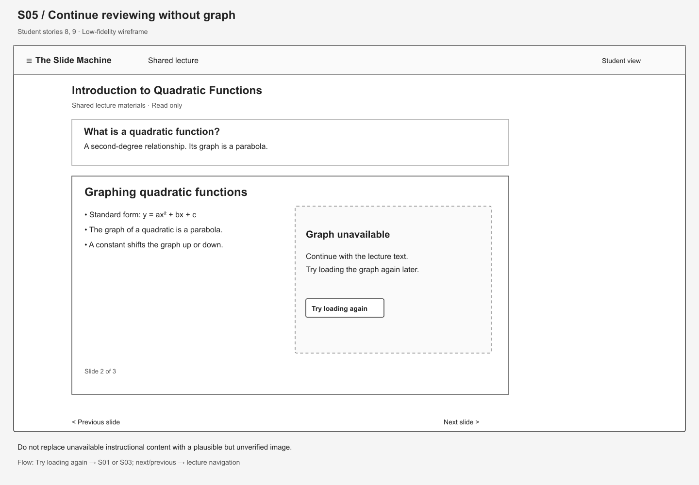

### S06 — Correction not yet available

Rwan's activity diagram includes a branch where a graph needs correction but no corrected version is available. This frame shows that state so the student does not mistake the old graph for a checked correction. The team still needs to define where that status comes from.

**Related story:** Student story 9.

**Button paths:** continue reviewing → lecture navigation; later correction → S02.

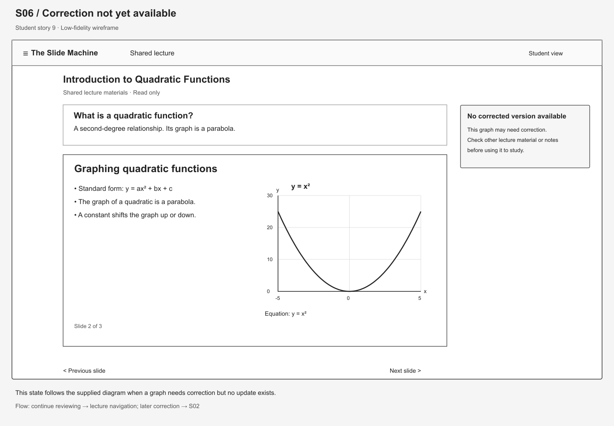

### S07 — Student-facing live presentation

This is the presentation students see during the lecture, with the graph and a short transcription line. It leaves out the instructor's editing controls. It is a presentation state; it does not assume a separate student livestream login or joining flow.

**Related story:** Student stories 1–7 / reference 07.

**Button paths:** lecture ends → shared lecture S01.

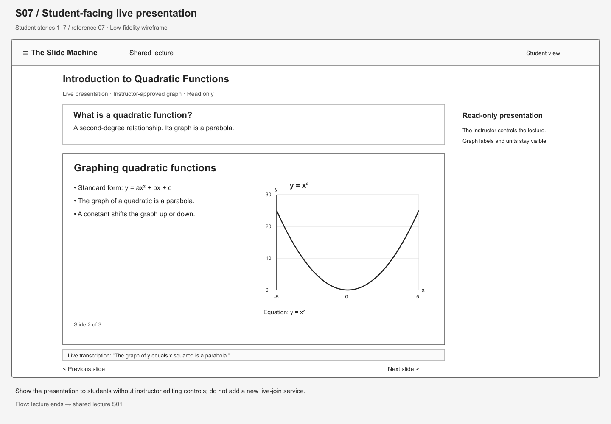

### S08 — View a chart in shared materials

This is the chart version of the shared lecture view. Students see the saved bar chart with Week 1 at 42% and Week 2 at 58%. If it fails to load, reuse S04 and S05 with chart wording.

**Related story:** Student stories 8, 11.

**Button paths:** next/previous → lecture navigation; load failure → S04 (chart wording).

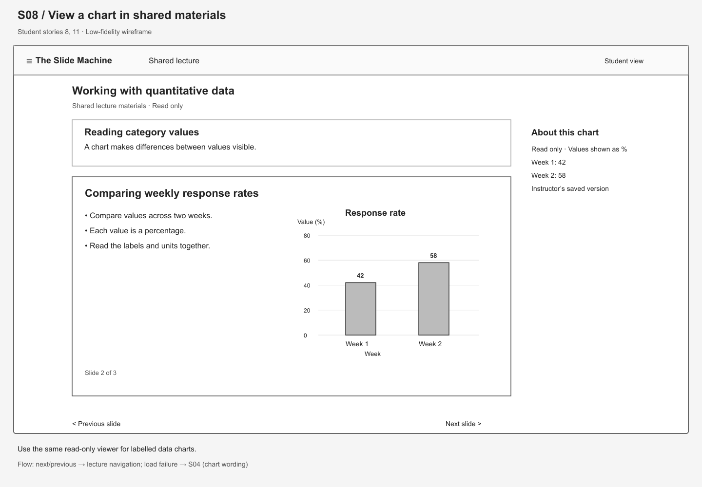

### S09 — Study a corrected chart

Students see the corrected line chart with Week 2 at 64%. Its chart type, values, labels, and units should match C05. Use the same loading and recovery behavior as the function-graph view.

**Related story:** Student stories 9, 11.

**Button paths:** next/previous → lecture navigation; load failure → S04 (chart wording).

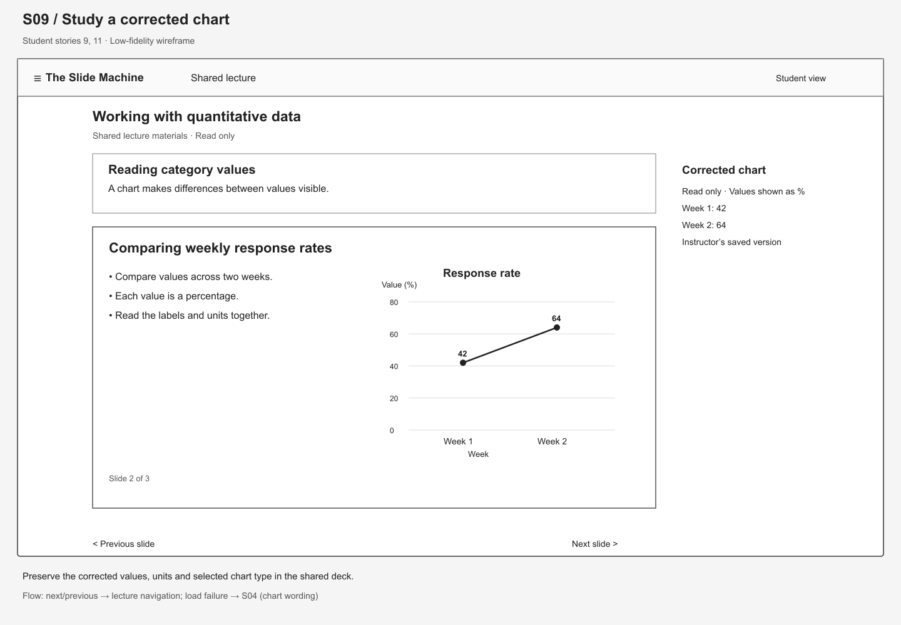

### E01 — Network error during generation

The graph request failed because of a connection problem. Retry starts generation again, and Continue without graph returns to the lecture. This follows the recovery choices shown in Matt's screenshot.

**Related story:** Instructor story 1.

**Button paths:** Retry → I02; Continue without graph → I01.

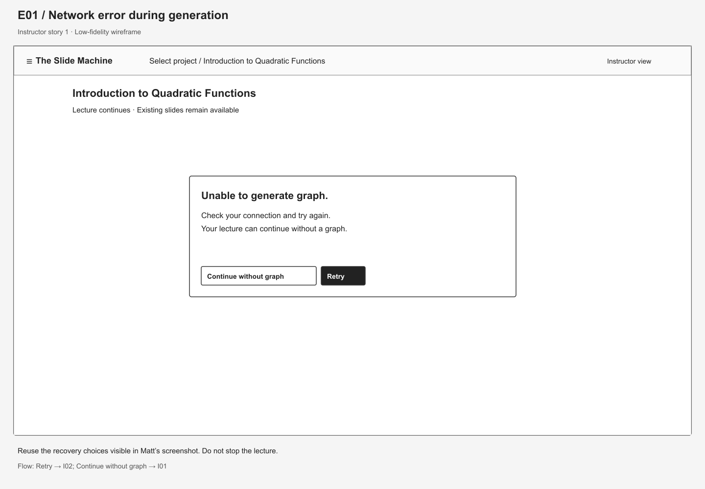

### E02 — Equation not recognized

The spoken equation could not be understood. The instructor can try saying it again, type a clearer request manually, or cancel. Manual editing opens I09 because there is no saved graph to overwrite yet.

**Related story:** Instructor story 1.

**Button paths:** Cancel → I01; Rephrase → I01 then I02; Edit manually → I09.

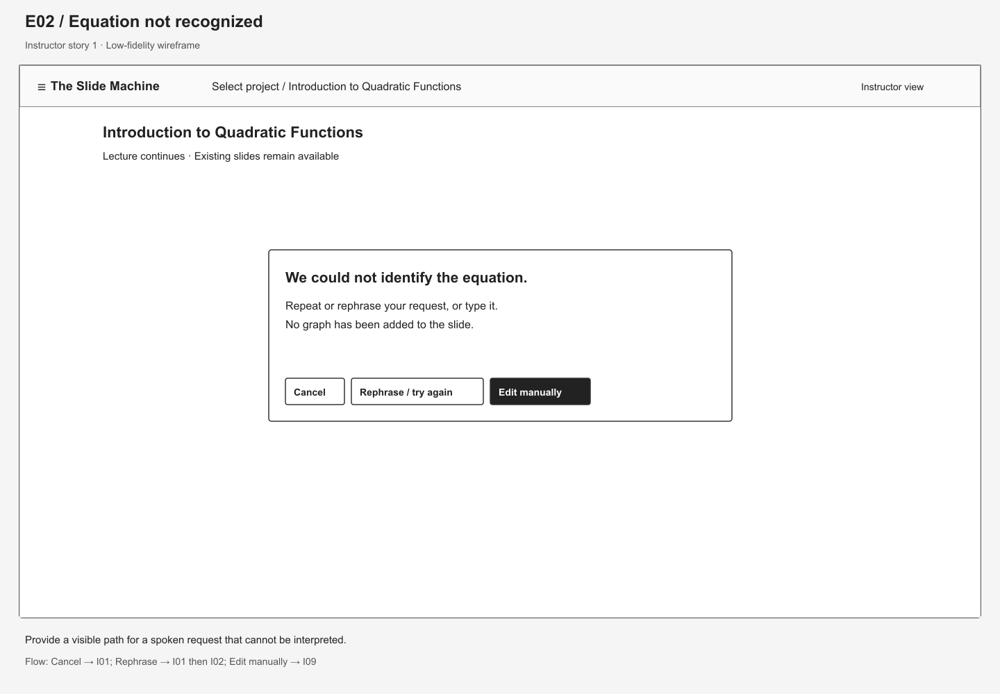

### E03 — Graph request declined or unsupported

The request could not be completed because it was declined or unsupported. The instructor can edit the request or continue teaching. Retry is shown for a temporary failure; a request that remains unsupported will need to be changed.

**Related story:** Instructor story 1.

**Button paths:** Continue → I01; Edit request → I09; Retry → I02.

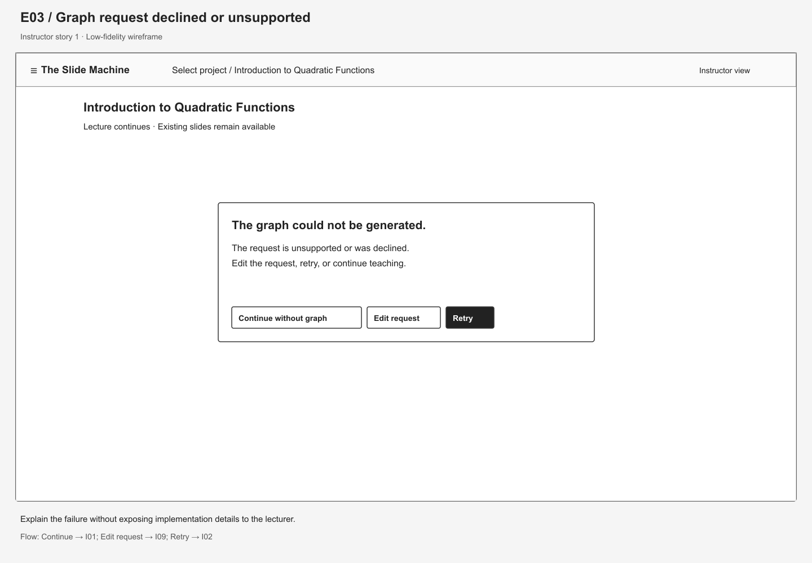

### E04 — Generation allowance reached

The generation allowance has been reached, so another immediate retry would not solve the problem. The instructor can continue without a graph. This covers the assignment's usage-cap failure case and should also be checked against the final activity diagrams.

**Related story:** Assignment failure-path requirement.

**Button paths:** Continue without graph → I01.

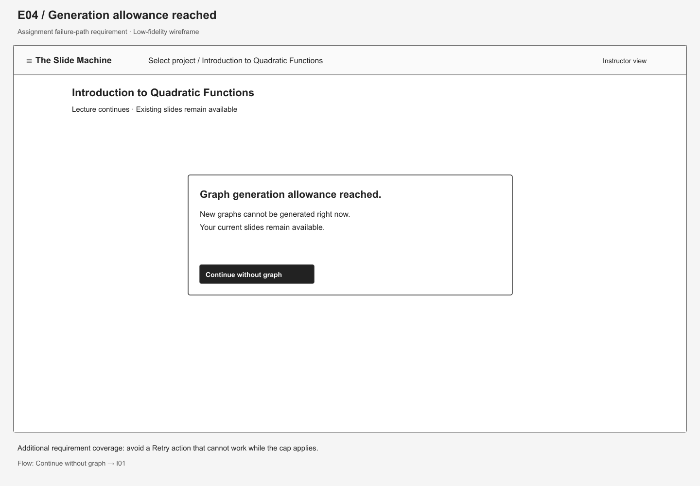

### E05 — Save failed / original retained

The updated graph could not be saved. Keep the draft available for Retry save, while the lecture still uses the original saved graph. Discard changes returns to that original version.

**Related story:** Instructor story 7.

**Button paths:** Retry save → I08 if successful, otherwise E05; Discard changes → I04.

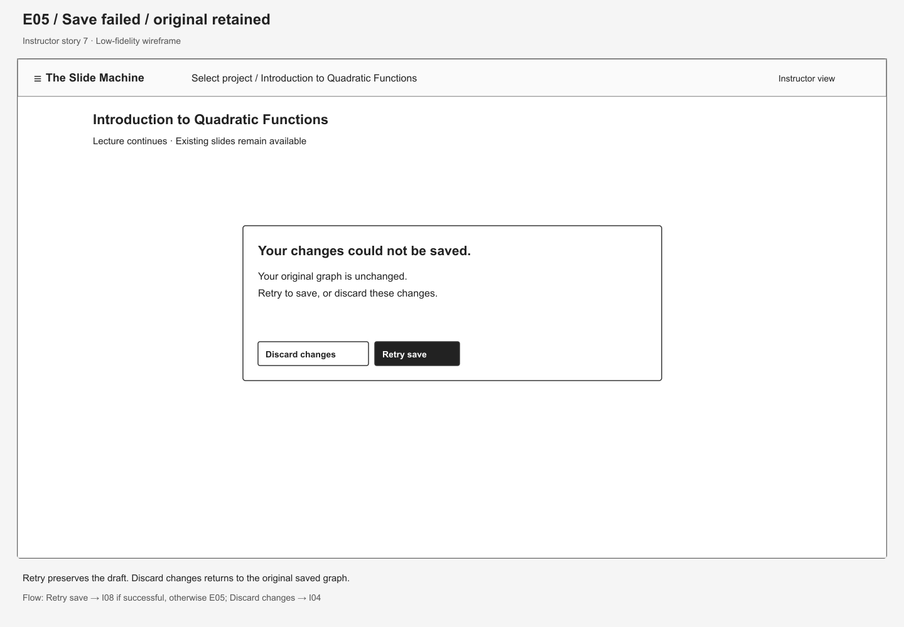
